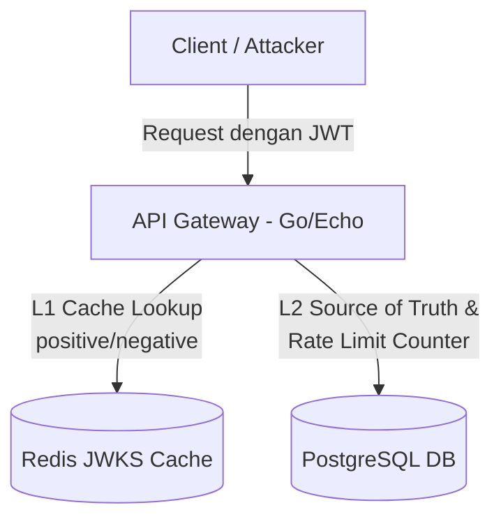
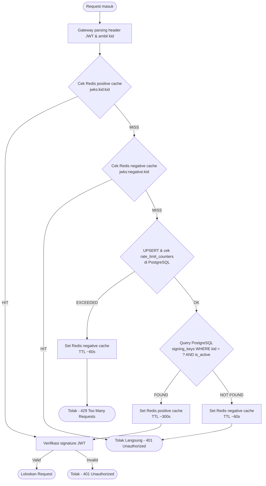
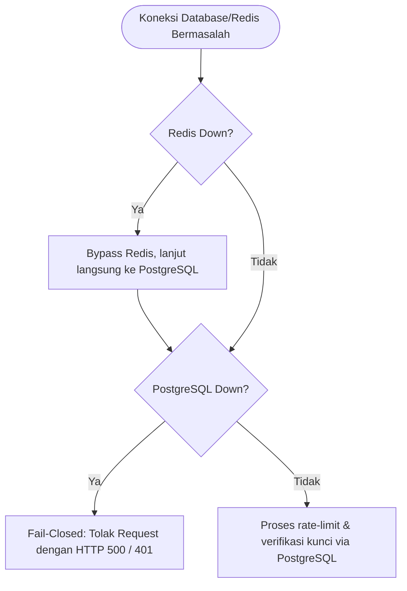
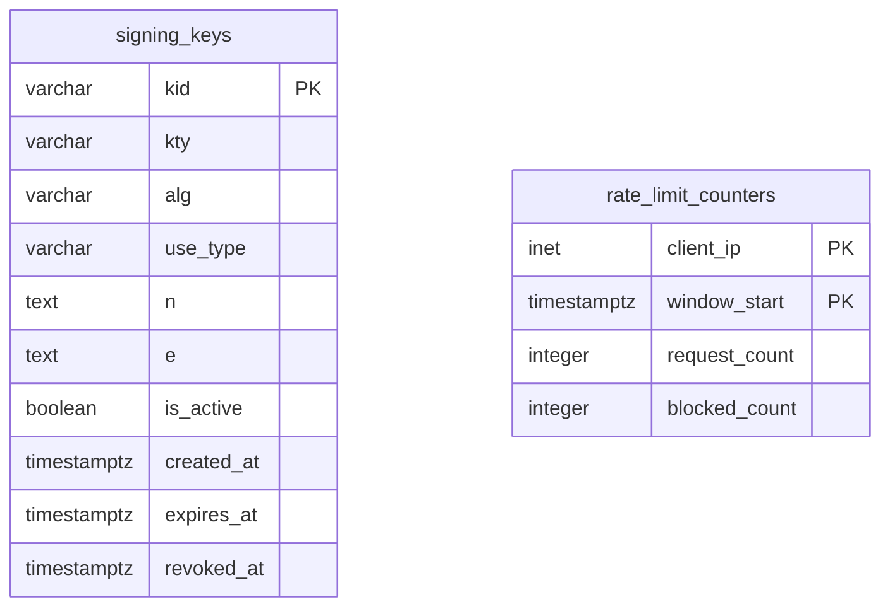

# Arsitektur Sistem dan Skema Database (Tahap 1)

Dokumen ini memuat diagram arsitektur komponen, alur resolusi kunci (mitigasi JWKS flooding), mekanisme ketahanan (fail-closed/fail-open), skema database PostgreSQL, dan skema cache Redis.

---

## 1. Arsitektur Komponen

Arsitektur sistem menggunakan pola hybrid caching dengan memisahkan Redis sebagai L1 cache (murni cache JWKS) dan PostgreSQL sebagai L2 source of truth serta rate limiter permanen.

---

## 2. Alur Resolusi Kunci (Mitigasi JWKS Flooding)

Mitigasi JWKS flooding meminimalkan beban query ke database melalui negative cache di Redis dan rate limiting atomik berbasis IP di PostgreSQL.

---

## 3. Mekanisme Fail-Closed / Failover

Gateway dirancang dengan prinsip **fail-closed** untuk menjamin keamanan sistem apabila dependensi database atau cache mengalami gangguan.

---

## 4. Entity-Relationship Diagram (PostgreSQL)

Skema database PostgreSQL memisahkan tabel kunci penandatangan (`signing_keys`) dan tabel pencatat batas laju request (`rate_limit_counters`).

---

## 5. Skema Cache Redis (L1 Cache JWKS)

Redis murni difungsikan sebagai L1 cache data JWKS dengan skema kunci sebagai berikut:

| Key Pattern | Tipe Data | TTL | Tujuan |
|---|---|---|---|
| `jwks:kid:<kid>` | STRING (JSON JWK) | ~300s | Cache positif untuk kunci signing yang valid |
| `jwks:negative:<kid>` | STRING (`"1"`) | ~60s | Cache negatif untuk `kid` yang tidak terdaftar di DB (mencegah database lookup berulang) |
