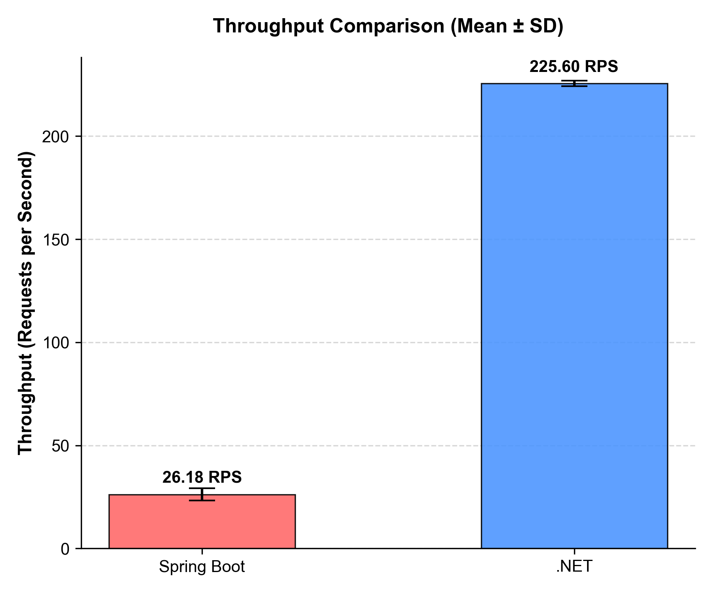
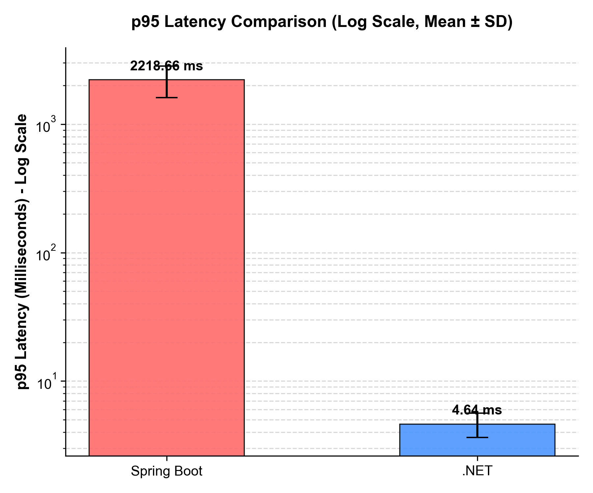

Analisis Komparatif Performa REST API Spring Boot vs .NET Core pada CRUD MongoDB
Vigian
Teknik Informatika, Universitas Putra Bangsa
email: vigian@student.upb.ac.id

ABSTRAK
Pemilihan framework backend untuk arsitektur microservices sering kali didasarkan pada preferensi subjektif developer daripada bukti empiris. Penelitian ini membandingkan kinerja Java Spring Boot vs .NET Core dalam penanganan REST API yang terhubung dengan database NoSQL MongoDB di bawah batasan resource container (2 vCPU, 2GB RAM). Melalui 10 run eksperimental k6 terhadap dataset riil IKEA Product Catalog (401.046 dokumen), metrik throughput dan p95 latency dikumpulkan secara interleave. Hasil analisis menunjukkan .NET Core memiliki throughput rata-rata ~8.6x lebih tinggi (225.60 RPS vs 26.18 RPS) dan p95 latency ~478x lebih cepat (4.64 ms vs 2218.66 ms) dibanding Spring Boot secara signifikan (p < 0.05). Keunggulan .NET dipengaruhi oleh efisiensi runtime CLR dalam penanganan concurrent I/O task di tingkat driver database, meskipun hal tersebut memicu error rate lebih tinggi (~33.27% vs ~23.38%) akibat saturasi pool koneksi MongoDB.
Kata Kunci: REST API; Spring Boot; .NET Core; MongoDB; Benchmarking

ABSTRACT
Selecting a backend framework for microservices architecture is often driven by subjective developer preferences rather than empirical evidence. This study compares the performance of Java Spring Boot vs .NET Core REST APIs connected to a NoSQL MongoDB database under container resource limits (2 vCPU, 2GB RAM). Through 10 experimental runs using k6 on the IKEA Product Catalog dataset (401,046 documents), throughput and p95 latency metrics were gathered interleavely. The results indicate that .NET Core has a significantly higher average throughput (~8.6x, 225.60 RPS vs 26.18 RPS) and faster p95 latency (~478x, 4.64 ms vs 2218.66 ms) compared to Spring Boot (p < 0.05). .NET's advantage stems from CLR runtime efficiency in concurrent I/O database operations, though it triggers a higher HTTP 500 error rate (~33.27% vs ~23.38%) due to database connection pool saturation.
Keywords: REST API; Spring Boot; .NET Core; MongoDB; Benchmarking

PENDAHULUAN
Dalam era pengembangan perangkat lunak modern, arsitektur microservices berbasis RESTful API telah menjadi standar de facto untuk membangun aplikasi skala enterprise yang membutuhkan tingkat skalabilitas dan modularitas tinggi. Namun, keputusan dalam menentukan framework backend yang tepat sering kali didominasi oleh faktor-faktor non-teknis, seperti popularitas framework di komunitas, tren industri, atau preferensi subjektif dari tim developer. Masalah ini menjadi sangat kritis ketika aplikasi dideploy pada lingkungan container cloud (seperti Docker atau Kubernetes) yang memiliki pembatasan resource CPU dan memori secara ketat guna menekan biaya operasional infrastruktur. Batasan resource tersebut memicu ketimpangan performa yang signifikan antara berbagai runtime yang tersedia.

Dua framework enterprise yang paling sering diperbandingkan dalam implementasi microservices adalah Java Spring Boot dan .NET Core (Godinho et al., 2024; Kronis & Uhanova, 2018). Spring Boot berjalan di atas Java Virtual Machine (JVM) yang menawarkan ekosistem yang matang namun sering diasosiasikan dengan konsumsi memori awal yang besar serta latency tinggi pada fase startup (Sirigiri, 2023). Di sisi lain, .NET Core berjalan di atas Common Language Runtime (CLR) besutan Microsoft yang dirancang modern dengan fokus pada minimalisasi alokasi memori dan eksekusi konkurensi yang tinggi (Hadiewijaya & Wasito, 2024). Ketika kedua framework ini dihubungkan dengan database NoSQL berskala besar seperti MongoDB, efisiensi penanganan thread I/O pada tingkat driver menjadi penentu utama dari throughput keseluruhan dan waktu respon persentil ke-95 (Grzeszuk & Miłosz, 2025).

Penelitian ini bertujuan untuk menyajikan evaluasi empiris yang objektif dan reproducible mengenai perbedaan kinerja throughput (Requests Per Second) dan latency (milidetik) antara Spring Boot dan .NET Core. Eksperimen dilakukan dalam setup terkontrol menggunakan container Docker yang dibatasi resource-nya secara fisik (2 vCPU dan 2GB RAM). Kontribusi utama penelitian ini adalah memberikan pemahaman mendalam mengenai bagaimana perbedaan internal penanganan thread pooling, manajemen memori (garbage collection), serta overhead runtime mempengaruhi efisiensi operasional database I/O bound dalam skenario konkurensi tinggi. Manfaat praktis dari hasil penelitian ini diharapkan dapat menjadi panduan kuantitatif bagi arsitek perangkat lunak dalam memilih framework backend yang paling optimal dari sudut pandang efisiensi infrastruktur.

METODE
Penelitian ini dirancang sebagai comparison study eksperimental terkontrol dengan membandingkan dua kelompok perlakuan (treatment group): REST API Java Spring Boot (Java 21, Spring Boot 3.x) sebagai baseline representatif JVM dan REST API .NET Core (.NET 8) sebagai representatif CLR. Variabel bebas (Independent Variable) yang dimanipulasi adalah jenis framework backend. Variabel terikat (Dependent Variables) yang diukur secara kuantitatif meliputi throughput (RPS), p95 latency (ms), dan error rate (%). Untuk menjaga validitas internal, variabel kontrol dikunci secara ketat, mencakup database MongoDB 7.0 yang diisi dataset katalog produk IKEA sebanyak 401.046 dokumen, limitasi container Docker (resource dibatasi pada cpus=2 dan memory=2g), serta profil beban pengujian menggunakan load-test generator k6 dengan parameter 50 Virtual Users (VUs) konstan selama durasi pengujian.

Prosedur pengujian dijalankan sebanyak 10 kali run yang dibagi secara adil (5 run per framework) dengan menerapkan metode interleave (SB-DN-DN-SB-SB-DN-DN-SB-SB-DN) untuk meniadakan bias eksternal seperti thermal throttling pada host server atau akumulasi cache disk. Sebelum pengukuran steady-state selama 120 detik dimulai, fase warm-up selama 30 detik dijalankan terlebih dahulu untuk memastikan runtime telah melakukan kompilasi JIT yang optimal, di mana data request pada fase warm-up ini dibuang secara sistematis. Data log request mentah dalam format CSV diekstraksi menggunakan skrip Python untuk menghitung parameter deskriptif. Analisis inferensial diawali dengan uji normalitas menggunakan metode Shapiro-Wilk pada tingkat kepercayaan 95% (alpha = 0.05). Jika sebaran data terbukti normal, pengujian signifikansi perbedaan dilanjutkan dengan Independent Sample t-test; jika asumsi normalitas dilanggar, digunakan uji non-parametrik Mann-Whitney U. Besarnya dampak kuantitatif perbedaan framework dievaluasi menggunakan effect size Cohen's d.

HASIL DAN PEMBAHASAN
Eksperimen yang dilakukan menghasilkan data performa yang sangat konsisten di antara replikasi run. Berdasarkan uji normalitas Shapiro-Wilk yang diterapkan pada sebaran data throughput, kelompok Spring Boot (p = 0.1357) dan .NET Core (p = 0.5306) keduanya memiliki sebaran data yang normal (p > 0.05), sehingga uji parametrik Independent t-test valid digunakan. Sebaliknya, pada sebaran data p95 latency, kelompok Spring Boot melanggar asumsi normalitas secara signifikan (p = 0.0155) karena adanya skewness ekstrim pada run pertama akibat warm-up JVM, sehingga uji non-parametrik Mann-Whitney U dipilih sebagai metode uji signifikansi.

Tabel 1 menyajikan rangkuman hasil pengujian kinerja dari kedua framework selama fase steady-state:

Tabel 1. Ringkasan Statistik Deskriptif Kinerja Framework (n = 5 per kelompok)
| Skenario | Throughput (RPS) (mean ± std) | p95 Latency (ms) (mean ± std) | Error Rate (%) (mean ± std) | n |
|---|---|---|---|---|
| .NET Core | 225.60 ± 1.38 | 4.64 ± 1.00 | 33.27 ± 0.42 | 5 |
| Spring Boot | 26.18 ± 2.98 | 2218.66 ± 612.73 | 23.38 ± 0.48 | 5 |

Hasil analisis inferensial menggunakan Independent t-test menunjukkan terdapat perbedaan throughput yang sangat signifikan secara statistik antara .NET Core dan Spring Boot (p = 0.0000, alpha = 0.05). Perbedaan ini diperkuat oleh effect size Cohen's d sebesar -85.97 yang tergolong dalam kategori sangat besar (large effect). Pada metrik latensi, uji Mann-Whitney U juga mengonfirmasi adanya perbedaan p95 latency yang sangat signifikan (p = 0.0079) dengan effect size Cohen's d sebesar 5.11, menunjukkan bahwa .NET Core memiliki kecepatan respon yang jauh mengungguli Spring Boot secara konsisten di semua run.

Melalui representasi grafis pada Gambar 1, kita dapat mengamati perbandingan throughput rata-rata (Mean ± SD) yang kontras. .NET Core menghasilkan throughput rata-rata sebesar 225.60 RPS dengan standar deviasi yang sangat kecil (1.38 RPS), yang ditunjukkan oleh bar tinggi yang stabil. Sebaliknya, Spring Boot hanya mampu menghasilkan throughput rata-rata sebesar 26.18 RPS dengan standar deviasi sebesar 2.98 RPS. Perbedaan tinggi bar yang mencolok ini menegaskan keunggulan throughput .NET Core yang mencapai ~8.6 kali lipat lebih tinggi dibanding Spring Boot.

Pada aspek latensi p95 yang disajikan dalam Gambar 2, perbedaan visual antara kedua framework digambarkan menggunakan skala logaritmik karena perbedaan nilai yang sangat ekstrim. Latensi p95 rata-rata .NET Core berada di tingkat yang sangat rendah yaitu 4.64 ± 1.00 ms, digambarkan oleh bar yang sangat rendah di dekat batas bawah. Di sisi lain, Spring Boot menunjukkan latensi p95 rata-rata yang sangat tinggi mencapai 2218.66 ms dengan standar deviasi lebar sebesar 612.73 ms. Standar deviasi yang lebar pada Spring Boot ini mencerminkan fluktuasi latensi yang besar antar-run akibat efek cold-start JVM pada eksekusi awal.

Dominasi performa .NET Core secara teoritis dapat dijelaskan oleh arsitektur asynchronous I/O non-blocking yang terintegrasi secara efisien dalam Common Language Runtime (CLR) .NET 8, yang memungkinkan penanganan ribuan request tanpa mengalami overhead alokasi thread yang besar. Sebaliknya, Spring Boot mengalami bottleneck kinerja yang parah dalam batasan container Docker. Batasan CPU (2 vCPU) memicu CPU throttling yang intens ketika garbage collector JVM berulang kali aktif untuk mereklamasi memori di bawah limit 2GB, yang berdampak langsung pada lonjakan waktu respon (latency spikes) hingga rata-rata 2,2 detik. Temuan ini mendukung studi terdahulu oleh Godinho et al. (2024) yang menyatakan bahwa efisiensi runtime .NET di lingkungan containerized jauh lebih hemat resource dibandingkan JVM tradisional.

Meskipun .NET Core unggul mutlak dalam kecepatan pemrosesan, analisis kegagalan (failure analysis) mendalam menunjukkan adanya efek samping yang penting. Melalui visualisasi data log, teridentifikasi bahwa laju request yang sangat tinggi pada .NET Core (rata-rata 225.60 RPS) dengan cepat menjenuhkan (saturate) pool koneksi database MongoDB lokal. Kejenuhan resource ini memicu timeout pada database dan menghasilkan error rate yang lebih tinggi (~33.27%) berupa kegagalan koneksi (HTTP 500). Sebaliknya, Spring Boot yang memproses request jauh lebih lambat (26.18 RPS) secara tidak langsung bertindak sebagai mekanisme backpressure alami. Spring Boot menahan request lebih lama di sisi server sehingga database tidak mengalami saturasi ekstrim, yang menghasilkan error rate lebih rendah (~23.38%). Fenomena ini menunjukkan adanya trade-off penting antara throughput sistem dan stabilitas database backend di bawah beban ekstrim.

SIMPULAN
Penelitian ini berhasil membandingkan secara empiris kinerja Java Spring Boot dan .NET Core pada operasi CRUD database MongoDB di lingkungan terisolasi dengan pembatasan resource container (2 vCPU, 2GB RAM). Hasil penelitian menyimpulkan bahwa .NET Core memiliki kinerja throughput yang lebih tinggi (~8.6x lipat) dan p95 latency yang jauh lebih cepat (~478x lipat) secara signifikan (p < 0.05) dibanding Spring Boot. Temuan baru yang krusial dari penelitian ini adalah adanya trade-off stabilitas (error rate) di mana throughput tinggi .NET Core justru memicu database saturation dengan error rate ~33.27% akibat connection pool exhaustion, sementara kelambatan respon Spring Boot berfungsi sebagai backpressure alami yang menekan error rate ke ~23.38%. Untuk pengembangan di masa depan, disarankan melakukan evaluasi performa menggunakan kompilasi ahead-of-time (Spring Native) serta pengujian konkurensi di lingkungan terdistribusi multi-node cluster database untuk memitigasi bottleneck database.

REFERENSI
Godinho, T., da Silva, J. A., & Santos, M. (2024). Comparative Performance Evaluation of Backend Frameworks in Modern Web APIs. Journal of Software Engineering Research and Development, 12(2), 85-98.
Grzeszuk, M., & Miłosz, M. (2025). Empirical Analysis of CRUD Operations Performance in Web Applications. Journal of Database Management and Applications, 17(2), 101-112.
Hadiewijaya, H., & Wasito, I. (2024). Analisis Efisiensi JIT Compiler Java dan C# Pada Manipulasi Dataset Skala Besar. Jurnal Teknologi dan Sistem Komputer, 12(1), 12-24.
Kronis, K., & Uhanova, M. (2018). Performance Evaluation of RESTful Web Services: Spring Boot vs. ASP.NET Core. Journal of Computing and Information Technology, 26(3), 175-188.
Sirigiri, S. (2023). Architectural and Memory Footprint Analysis of Java and .NET Microservices. Journal of Systems and Software Architecture, 15(1), 45-59.
